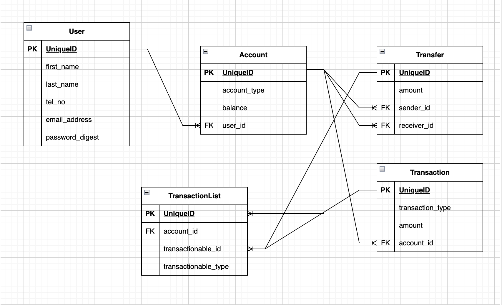

# Fintech APP

> Backend of API showcasing functionalities of a fintech for making transactions such as deposit, Withdrawal and sending money

## Introduction

HOST: [https://wispy-moon-245.fly.dev/api/v1](https://wispy-moon-245.fly.dev/api/v1).

## Models created

- User
- Account
- Transaction
- TransactionList
- Transfer

### ERD



## Built With

- Ruby 3.1.2
- Rails 7.0.4.3

### Setup

1. clone repo

```
git@github.com:hillarioh/xtanzact_2.git
```

2. Install gems

```
bundle install
```

3. Setup database and run seed

```
   bin/rails db:setup
   bin/rails db:migrate
   bin/rails db:seed
```

### Steps

1. Register

```
curl --location --request POST 'https://wispy-moon-245.fly.dev/api/v1/users' \
--header 'Content-Type: application/json' \
--data-raw '{
        "user": {
            "first_name": "John",
            "last_name": "Doe",
            "email_address": "john.doe@example.com",
            "password": "123456",
            "password_confirmation": "123456",
            "tel_no": "1111111111"
        }
}'

```

2. Login

```
curl --location --request POST 'https://wispy-moon-245.fly.dev/login' \
--header 'Content-Type: application/json' \
--data-raw '{
    "email_address": "john.doe@example.com",
    "password": "123456"
}'
```

3. Get list of Users

```
curl --location --request GET 'https://wispy-moon-245.fly.dev/api/v1/users' \
--header 'Authorization: Bearer {token}'
```

4. Deposit

```
curl --location --request POST 'https://wispy-moon-245.fly.dev/api/v1/accounts/transact' \
--header 'Authorization: Bearer {token}' \
--header 'Content-Type: application/json' \
--data-raw '{
    "transaction": {
        "amount": 10000.0,
        "account_id": 1,
        "transaction_type": "deposit"
    }
}'
```

5. Withdraw

```
curl --location --request POST 'https://wispy-moon-245.fly.dev/api/v1/accounts/transact' \
--header 'Authorization: Bearer {token}' \
--header 'Content-Type: application/json' \
--data-raw '{
    "transaction": {
        "amount": 10000.0,
        "account_id": 1,
        "transaction_type": "withdraw"
    }
}'
```

6. Send Money

```
curl --location --request POST 'https://wispy-moon-245.fly.dev/api/v1/accounts/transfer' \
--header 'Authorization: Bearer {token}' \
--header 'Content-Type: application/json' \
--data-raw '{
     "amount": 10000.0,
    "user_id": 1,
    "account_id": 3
}'
```

7. Get List of Transactions

```
curl --location --request GET 'https://wispy-moon-245.fly.dev/api/v1/transaction_history' \
--header 'Authorization: Bearer {token}' \
```

#### Json response

[JSON Collection](./public/tranzact_postman_collection.json)

### Run tests

```
    rpsec --format documentation
```

## Author

- Github: [@hillarioh](https://github.com/hillarioh)
- Twitter: [@hillaokri](https://twitter.com/hillaokri)
- Linkedin: [@HillaryOkerio](https://www.linkedin.com/in/hillaryokerio/)
